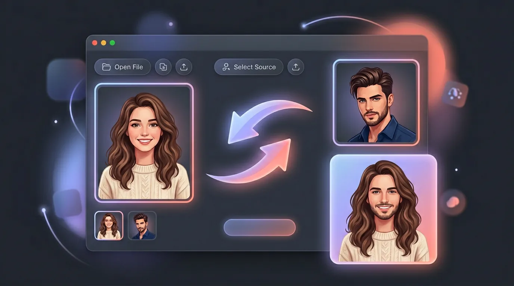
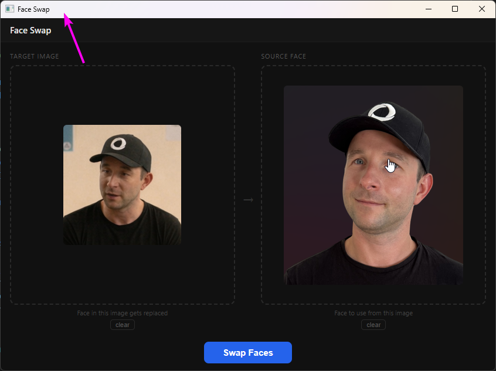

#  face-swap

Swap a face from one photo into another, all on your own machine

Windows

<!-- media: hero -->
<!--  -->
<!-- /media: hero -->



## What it is

This uses InsightFace to swap a face from one image into another, and it all runs locally with no cloud API. It's a small window where you drop in the target image on the left and the source face on the right.

While it runs you can watch the logs, so you know what's going on, and the result gets saved next to the original with `_face-swapped` on the end of the name.



## Get it

Paste this into your AI coding agent (Claude Code, Codex, Cursor...):

> Clone https://github.com/mikecann/face-swap and make it my own. It's one of Mike
> Cann's personal tools, so read the README first, change anything specific to his
> setup to suit mine, then help me get it running.

### Or set it up by hand

Install Git, [Bun](https://bun.sh) and Python on PATH. InsightFace may need C++ build tools if pip builds it from source. For video processing, install ffmpeg on PATH too.

In PowerShell:

```powershell
git clone https://github.com/mikecann/face-swap
cd face-swap
powershell -ExecutionPolicy Bypass -File .\install.ps1
```

The installer runs `deps.ps1` to check Python and install InsightFace, ONNX Runtime and OpenCV, then runs `bun install`. It creates a Face Swap Start Menu shortcut and image/folder Explorer entries under **Mike's Tools**. It also writes a small `face-swap.bat` command to `C:\dev\tools`; add that folder to PATH if you want the command. Use `-ToolsDir` to choose another location, or `-SkipDeps` if dependencies are already installed.

No API keys are needed. If you want to set an optional download folder, copy `.env.example` to `.env` in this clone and fill in `FOLDER_PATH`. The launchers load that file when they start.

On first launch, the app builds its desktop bundle. It can download `inswapper_128.onnx` from inside the window, or you can put it in `%LOCALAPPDATA%\face-swap\models\inswapper_128.onnx`. InsightFace also downloads its face detection models when first used, so setup needs an internet connection.

## Using it

- Right-click an image and choose **Mike's Tools > Face Swap** to load the target.
- Right-click a folder or folder background to open an empty window.
- Or open **Face Swap** from Windows Search, then drop in your images.

Choose the target on the left and the source face on the right, then start the swap. The source's largest face is used, and each detected face in the target is replaced. The next view shows live logs, then the result and its saved location.

The result is saved beside the original target, for example `photo_face-swapped.jpg`. You can also process a video with ffmpeg installed.

For the Python worker directly:

```powershell
python .\face-swap.py --target photo.jpg --source donor.jpg --output result.png
```

## Development

```sh
bun install
bun test
bun run typecheck
bun run build:dev
```

Electrobun is pinned to 1.18.1 because this app uses its version 1 Bun SDK.

`bun start` builds and opens the app; `bun run dev` uses the existing build. The GUI launchers set `TOOL_DIR` to this clone so the worker stays outside the bundled JavaScript.

The existing macOS development launcher is included. `bash install.sh --with-bun-install` links it into `~/.local/bin`, or pass a different bin directory. It accepts an optional image/folder path and loads this clone's `.env`. The backend still invokes `cmd.exe` and uses Windows storage paths, so face swapping is currently Windows-only. To remove the macOS symlink, remove `~/.local/bin/face-swap`.

CI runs Bun tests, TypeScript checks, an Electrobun build, Python syntax/CLI checks and PowerShell parsing. It does not download face models or run inference.

## Dependencies and troubleshooting

- `deps.ps1` checks `insightface`, `onnxruntime-gpu` (with a CPU fallback) and `opencv-python`. Run it again if an import is missing.
- CUDA is used if ONNX Runtime exposes it, otherwise processing falls back to CPU. A GPU is optional.
- Models live under `%LOCALAPPDATA%\face-swap\models`; logs and temporary sessions live in the same `face-swap` directory.
- If the first build fails, run `bun run build:dev` in this clone to see the error.
- Re-run the installer if you move the clone. The shortcuts point at its current location.

To uninstall Windows integration:

```powershell
powershell -ExecutionPolicy Bypass -File .\uninstall.ps1
```

Use the same `-ToolsDir` if you chose a custom location. Uninstall removes this clone's entries and generated icon, leaving other tools' menus, your models, logs and Python packages alone.

## More tools

You can find my other tools at [mikerosoft.app](https://mikerosoft.app).

MIT licensed.
